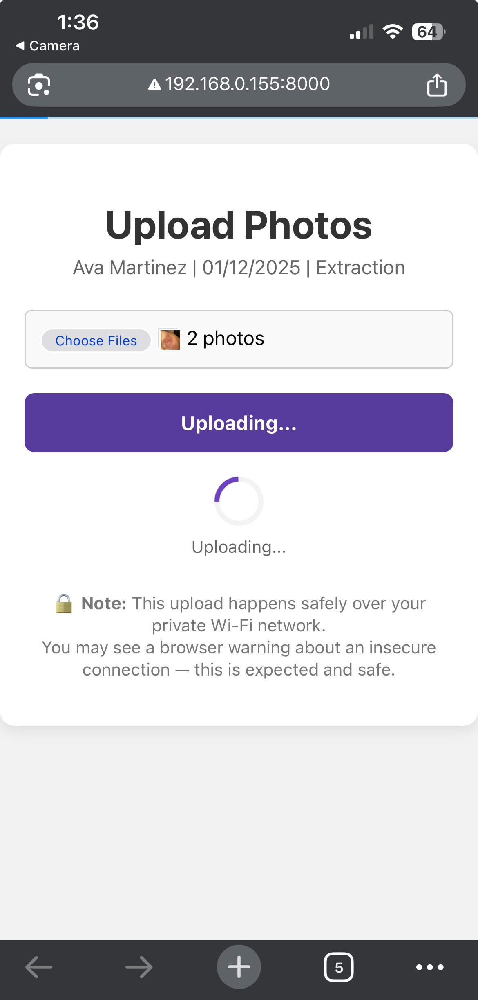
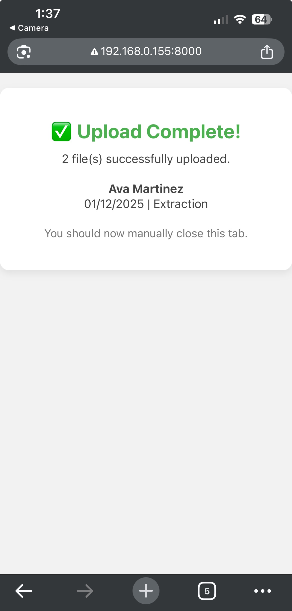

# SkinPro

A local-first client management web app for estheticians and skincare professionals. The UI runs on Next.js and works directly against the SkinPro SQLite database and local file storage.

## Features

- Manage client profiles with demographic info, health details, and notes
- Schedule and track appointments
- Upload and compare treatment photos (QR and local uploads)
- Generate customizable skincare prescriptions (templates, highlights, PDF export)
- Track follow-up alerts and maintenance items
- All data saved locally in user-specified folders
- Responsive UI with caching and async image processing
- Optional PIN gate with expiring share and upload tokens

## Tech Stack

- **Node.js** + **Next.js** (React)
- **TypeScript**
- **SQLite** via **better-sqlite3**
- **PDFKit** for prescriptions and **pdfjs-dist** for preview
- **Sharp** for image processing, **qrcode** for QR links

## Local Use Notes

- This is a private, local-first tool built for a specific studio workflow.
- All data stays on disk in the `SkinProData/` folder (SQLite + images + exports).
- The web UI reads the same data as the desktop app; run the desktop app once to create the data folder and pointer file.
- Optional configuration and security settings are documented in `src/README.md`.

## Quick Start (Web UI)

```bash
cd src
npm install
npm run dev:local
```

## Highlights

- QR-based photo uploads with tokenized access
- PDF prescription generation with templates and text highlighting
- Local-first architecture with no third-party storage dependencies

## Screenshots

### Clients Tab


### Info Tab (Client Demographics & History)


### Appointments Tab


### Photos Tab (Before & After Comparison)


### QR Upload Window → Upload In Progress → Upload Complete

<div align="left">
  
  
  
</div>

### Prescriptions Tab


### Prescription Generator (Dynamic Form)


### Finished Prescription Preview (Printable)


### Alerts Tab (Follow-up Reminders)


## Acknowledgments

This application was developed in collaboration with a licensed skincare professional at **Apotheca Day Spa**. Special thanks for contributing real-world workflows, testing feedback, and helping shape a practical tool for estheticians.

## Contact

[brianjames.dev@gmail.com](mailto:brianjames.dev@gmail.com)  
[LinkedIn](https://www.linkedin.com/in/brianjames-dev/)  
[Instagram](https://www.instagram.com/brianallenjames)
