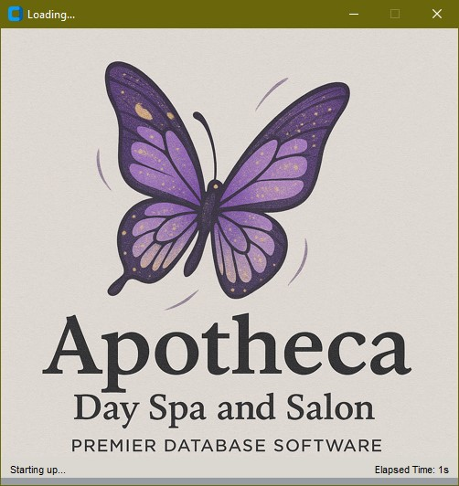
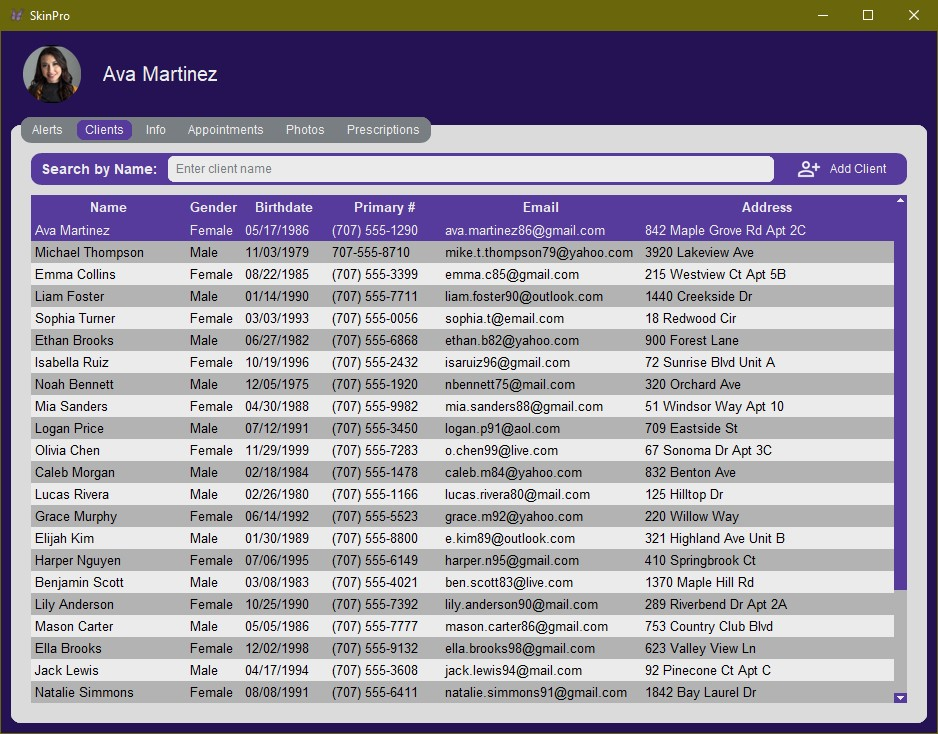
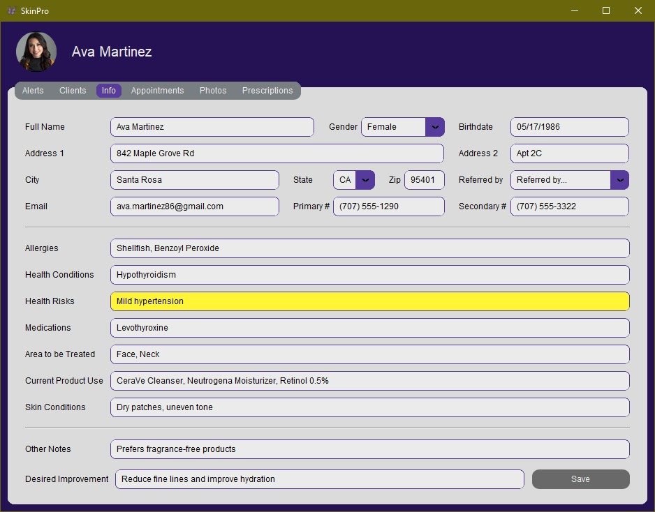
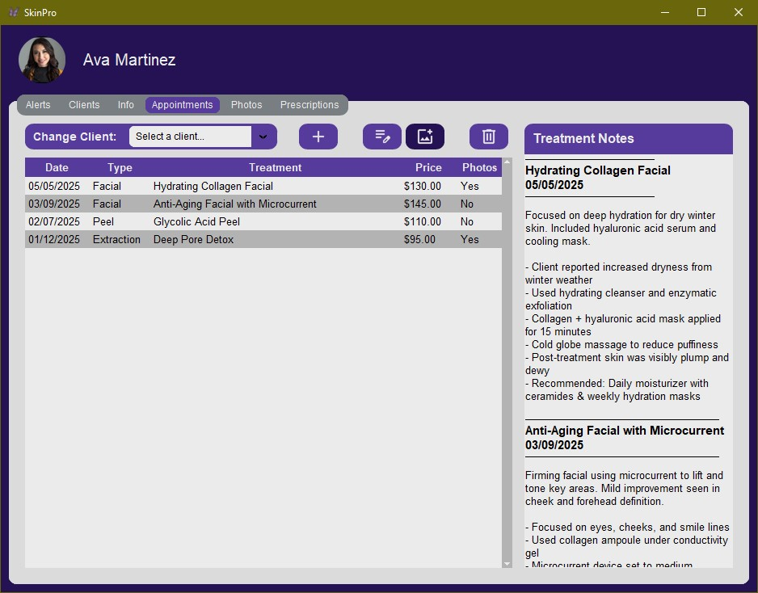
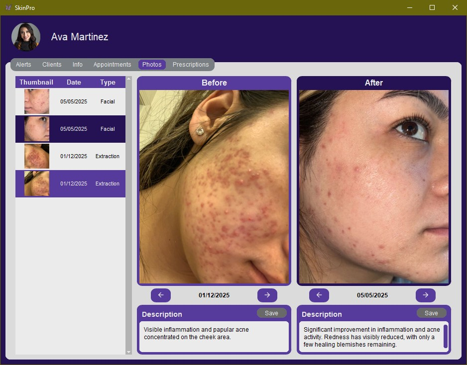
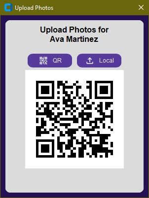
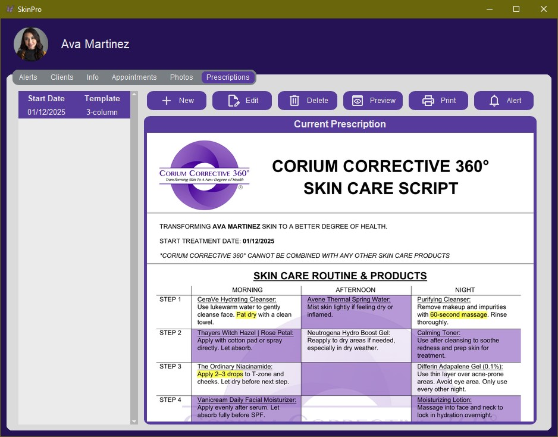
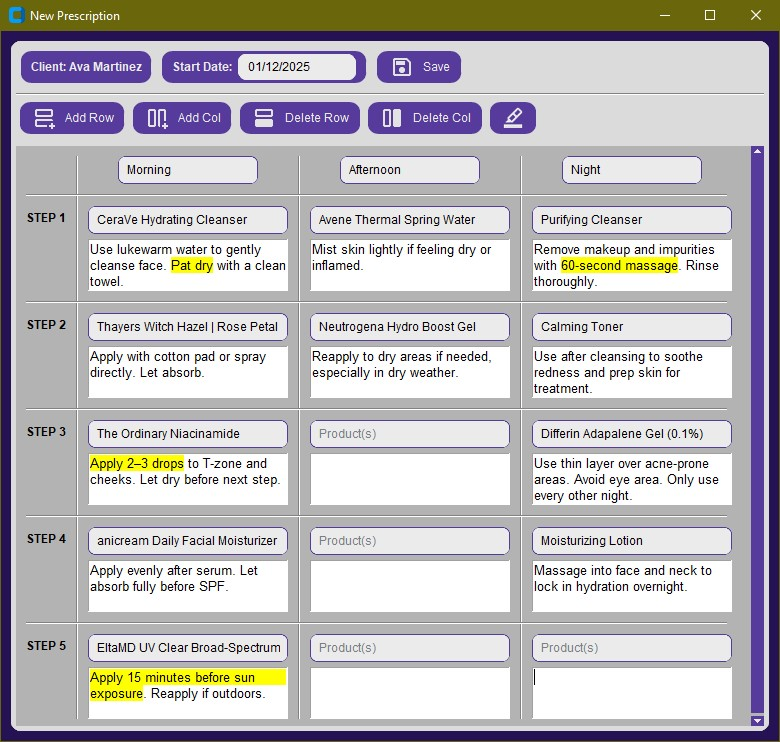
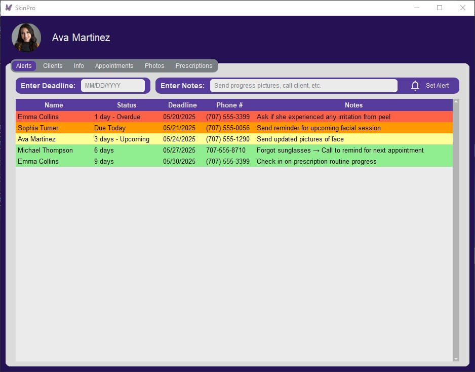

# SkinPro

A full-featured desktop application built for estheticians and skincare professionals to manage client data, appointments, treatment photos, prescriptions, and follow-up alerts. Built with Python and CustomTkinter.

---

## 🌟 Features

- 📇 Manage client profiles with detailed demographic and health info
- 📆 Schedule and track appointments
- 📸 Upload photos via QR code or locally and compare before/after
- 📝 Generate customizable skincare prescriptions (2–4 columns, text highlighting)
- 🔔 Set and track follow-up alerts (e.g., photo requests)
- 📂 All data saved locally in user-specified folders
- 🧠 Smart caching and threaded image loading for responsive UI
- 🛠️ Packaged with PyInstaller for easy distribution

---

## 🚀 Tech Stack

- **Python**
- **CustomTkinter** for the UI
- **SQLite** for local database management
- **Flask** for QR code photo upload server
- **ReportLab** for PDF generation
- **Poppler** for PDF preview (via `pdf2image`)
- **Pillow**, `os`, `threading`, `tkinter.ttk` for backend/UI logic

---

## 📸 Screenshots

### 🚪 Splash Screen


### 👩 Clients Tab


### 📝 Info Tab (Client Demographics & History)


### 📅 Appointments Tab


### 📷 Photos Tab (Before & After Comparison)


### 📲 QR Upload Window → Upload In Progress → Upload Complete



### 💊 Prescriptions Tab


### 🧾 Prescription Generator (Dynamic Form)


### 🖨️ Finished Prescription Preview (Professional Printable)


### 🔔 Alerts Tab (Follow-up Reminders)


---

## 📁 Project Structure

```
SkinPro/
├── .vscode/                       # VS Code config
├── class_elements/                # Shared UI components and core app logic (popups, styling, cache, splash screen, etc.)
|   ├── pdf_generators/            # PDF layout generators (2–4 column formats)
│   │   ├── pdf_2col.py
│   │   ├── pdf_3col.py
│   |   ├── pdf_4col.py
│   │   └── prescription_entry_popup.py
│   ├── PdfRenderThread.py
│   ├── build_corium_theme.py
│   ├── corium_theme.json
│   ├── ctk_popup.py
|   ├── database.py
|   ├── image_cache.py
|   ├── img_load_threading.py
│   ├── photo_upload_popup.py
|   ├── products.py
│   ├── profile_card.py
│   ├── splash_screen.py
│   ├── treeview_styling_dark.py
│   └── treeview_styling_light.py
├── icons/                         # App icon assets
├── tabs/                          # Individual tab views (Clients, Info, Photos, etc.)
│   ├── _1_clients_page.py
│   ├── _2_info_page.py
│   ├── _3_appointments_page.py
│   ├── _4_photos_page.py
│   ├── _5_prescriptions_page.py
│   ├── _6_alerts_page.py
│   └── client_app.py
├── upload_server/                 # Flask server for QR-based photo uploads
│   ├── templates/
│   │   ├── upload.html
│   │   └── upload_success.html
│   ├── qr_helper.py
│   └── server.py
├── utils/                         # Utility scripts for path and data management
│   ├── data_manager.py
│   └── path_utils.py
├── .gitignore
├── SkinProToExe.txt               # PyInstaller packaging notes
└── main.py                        # App entry point
```

## ⚙️ Setup Instructions

1. **Clone the repository**
   ```bash
   git clone https://github.com/yourusername/SkinPro.git
   cd SkinPro
   ```

2. **Create a virtual environment and install dependencies**
   ```bash
   python -m venv venv
   source venv/bin/activate      # On Windows: venv\Scripts\activate
   pip install -r requirements.txt
   ```

3. **Install Poppler**
   - **Windows:** [Download Poppler](http://blog.alivate.com.au/poppler-windows/) and add the `/bin` folder to your system PATH.
   - **macOS:** Use Homebrew:
     ```bash
     brew install poppler
     ```
   - **Linux (Debian/Ubuntu):**
     ```bash
     sudo apt install poppler-utils
     ```

4. **Run the application**
   ```bash
   python main.py
   ```

---

## 📦 Packaging to .exe (Windows)

Use [auto-py-to-exe](https://github.com/brentvollebregt/auto-py-to-exe) for creating an executable:

- Select **One-folder** mode during testing
- Ensure `main.py` uses:
   ```python
   if __name__ == "__main__":
       # prevent UI from re-launching when Flask starts
   ```
- Manually include Poppler binaries in the `dist/` folder if needed
- Add necessary image/icon assets to the `static/` folder and include them in build settings

---

## 📣 Acknowledgments

This application was developed in collaboration with a licensed skincare professional at **Apotheca Day Spa**. Special thanks for contributing real-world workflows, testing feedback, and helping shape a practical tool for estheticians.

---

## 📬 Contact

📧 [brianjames.dev@gmail.com](mailto:brianjames.dev@gmail.com)  
🔗 [LinkedIn](https://www.linkedin.com/in/brianjames-dev/)  
🎸 [Instagram](https://www.instagram.com/brianallenjames)

---
